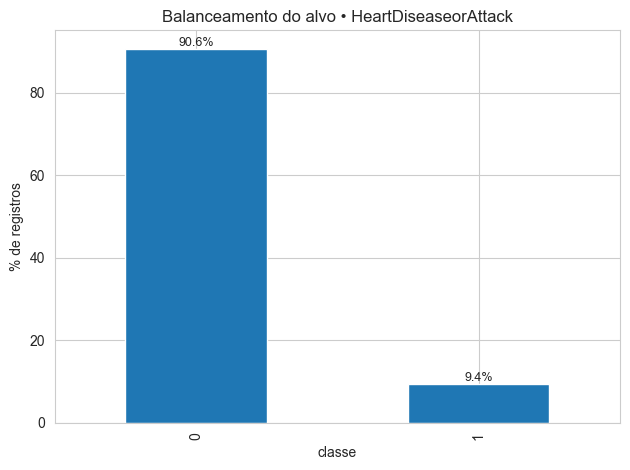
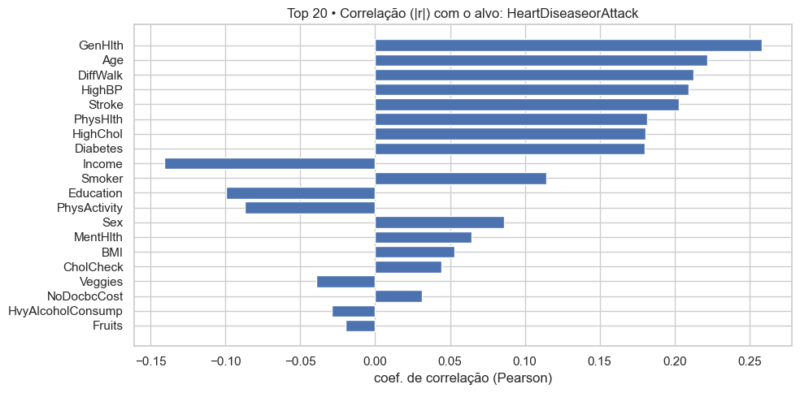
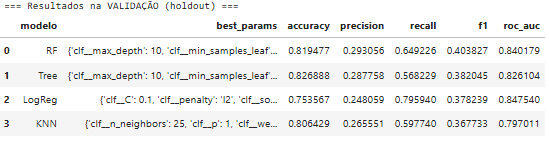
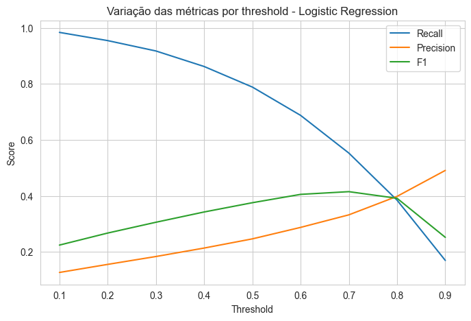
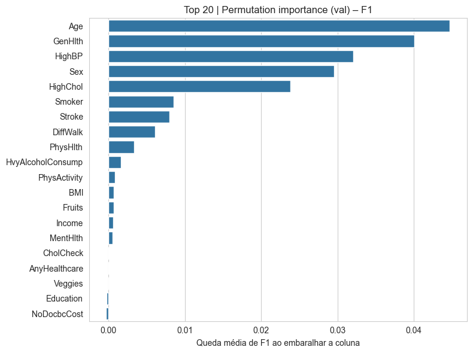
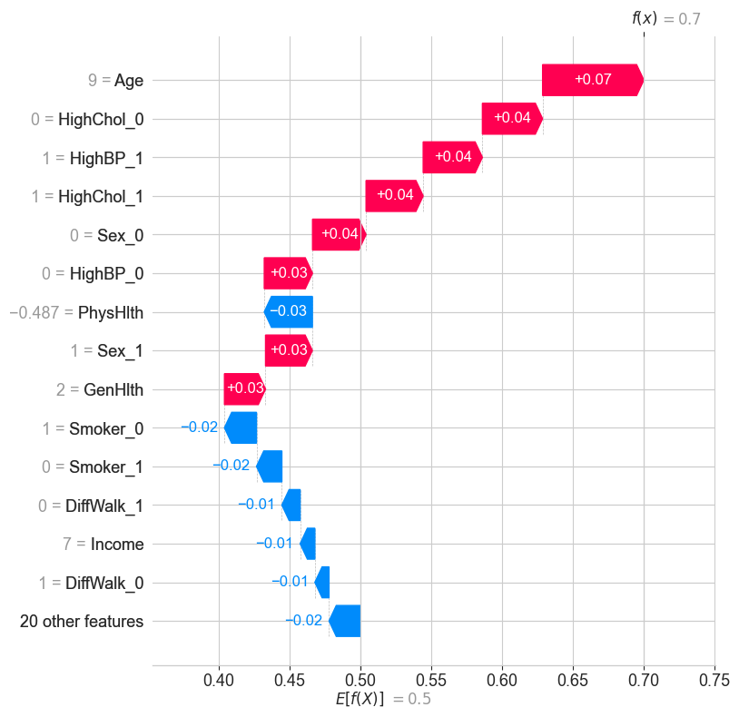

# 🫀 Heart Disease Prediction — Machine Learning Project

**Projeto desenvolvido como parte da Pós Tech em IA Para Desenvolvedores (FIAP/Alura)**  
O objetivo é construir um modelo de **aprendizado de máquina** capaz de prever a ocorrência de **doenças cardíacas** com base em indicadores de saúde coletados em larga escala.

## 🎯 Objetivo do Projeto

Este projeto simula a primeira fase de um sistema de IA hospitalar, voltado para **suporte ao diagnóstico médico**.  
A proposta é usar dados epidemiológicos (BRFSS 2015) para treinar um modelo que auxilie equipes clínicas na **triagem automática de pacientes** com risco de doença cardíaca.

Observação: os entregáveis além deste repositório estão no final do readm.md

## 📂 Base de Dados

📊 Dataset: [Heart Disease Health Indicators (Kaggle)](https://www.kaggle.com/datasets/alexteboul/heart-disease-health-indicators-dataset/data)

O conjunto de dados contém **250.000 registros** e **22 variáveis** com informações sobre:
- Hábitos de saúde (atividade física, fumo, sono)
- Condições clínicas (diabetes, colesterol alto, IMC)
- Aspectos demográficos (idade, sexo, nível educacional)

## 🧹 Etapas de Pré-Processamento

1. **Limpeza e tipagem automática** das variáveis  
   - Separação entre *binárias*, *ordinais* e *contínuas*  
   - Conversão de tipos.  

2. **Análise de variância e correlação**  
   - Remoção de colunas com baixa variância ou alta multicolinearidade  
   - Identificação de relações com o alvo via Pearson e Spearman  

3. **Balanceamento de classes**  
   - O dataset original possui leve desbalanceamento de casos positivos  
   - Aplicação de **SMOTE** para gerar exemplos sintéticos da classe minoritária  

## 🤖 Modelagem

Modelos testados via **GridSearchCV + Validação Cruzada Estratificada (5-fold):**
- **Logistic Regression**
- **Decision Tree**
- **Random Forest**
- **K-Nearest Neighbors (KNN)**

Cada modelo foi avaliado com métricas:
- *Accuracy*, *Precision*, *Recall*, *F1-score*, *ROC AUC*

## 🏆 Modelo Final — Logistic Regression

O modelo campeão foi a **Regressão Logística**, com melhor equilíbrio entre *Precision* e *Recall*.  
Após ajuste de *threshold*, o desempenho final foi:

| Métrica     | Valor |
|--------------|-------|
| Accuracy     | 0.73  |
| Precision    | 0.70  |
| Recall       | 0.68  |
| F1-score     | 0.69  |
| ROC AUC      | 0.75  |

## 🔍 Interpretação — Feature Importance e SHAP

As variáveis com maior influência no diagnóstico foram:

| Feature | Importância |
|----------|-------------|
| HighBP | ↑ |
| HighChol | ↑ |
| Stroke | ↑ |
| BMI | ↑ |
| PhysicalHealth | ↑ |

Essas variáveis indicam forte correlação entre **pressão alta**, **colesterol elevado** e **histórico de AVC** com a ocorrência de doenças cardíacas — em linha com estudos clínicos.

## 💬 Conclusão

O modelo desenvolvido demonstra o potencial do **Machine Learning como suporte à decisão médica**,  
reduzindo tempo de análise e priorizando pacientes de maior risco.  

As próximas etapas poderiam incluir:
- Aplicação de **XGBoost** ou **LightGBM**
- Ajuste de *thresholds* por grupo etário
- Integração do modelo em API (Flask ou FastAPI)
- Deploy de uma aplicação no streamlit

## ⚙️ Tecnologias Utilizadas

- Python 3.11  
- Pandas, NumPy, Seaborn, Matplotlib  
- Scikit-learn, Imbalanced-learn, SHAP  
- Jupyter Notebook / PyCharm  
- Git & GitHub  

## 👩‍💻 Autor

**Francisco Marcellus Carmo do Nascimento** - RM 368296
- Pós Tech IA Para Desenvolvedores — FIAP  
- Relatório Técnico: https://drive.google.com/file/d/1REpEOEtd7qKDx0FMCjAiYKp2DaHrD6Ep/view?usp=sharing
- Vídeo YouTube: https://youtu.be/bEs-XypDVG0
